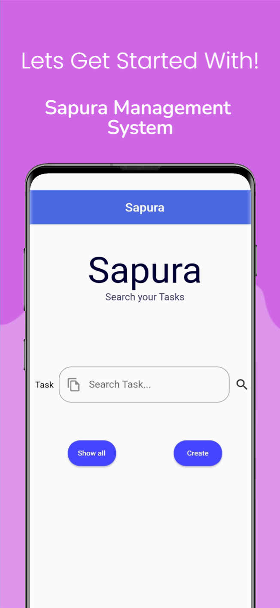

# Company Task Management App

## Overview

The Supura Task Management App is a simple and efficient solution for organizing and managing tasks within your company. Whether you are a small startup or a large enterprise, this app helps streamline task assignment, tracking, and completion.

## Features

- **User-friendly Interface:** Intuitive design for easy navigation and quick task management.
- **Task Creation:** Create new tasks with details such as title, description, due date, and assignee.
- **Task Assignment:** Assign tasks to specific team members for clear responsibility.
- **Task Status:** Track the status of each task, whether it's pending, in progress, or completed.
- **Filter and Search:** Easily find tasks using filters and search functionality.
- **Responsive Design:** Access and manage tasks from any device, ensuring flexibility and convenience.

## Getting Started

### Screenshots

| Screenshot 1                                   | Screenshot 2 | Screenshot 3 |
|------------------------------------------------|--------------|--------------|
|  |  |  |

| Screenshot 4 | Screenshot 5 |
|--------------|--------------|
|  |  |

## Usage

1. log in using credentials (contact Syf-almjd to get yours.
2. Create new tasks, assign them to team members, and set due dates.
3. Track the status of tasks on the dashboard.
4. Edit or mark tasks as completed as needed.

## Contributing

Contributions are welcome! Please follow our [contribution guidelines](CONTRIBUTING.md).

## License

This project is licensed under the MIT License - see the [LICENSE](LICENSE) file for details.

